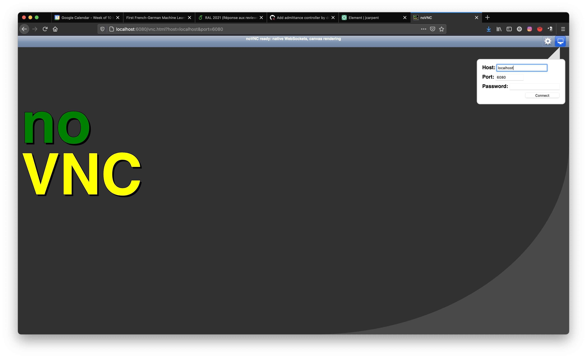
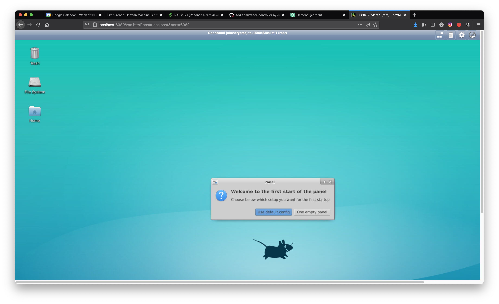
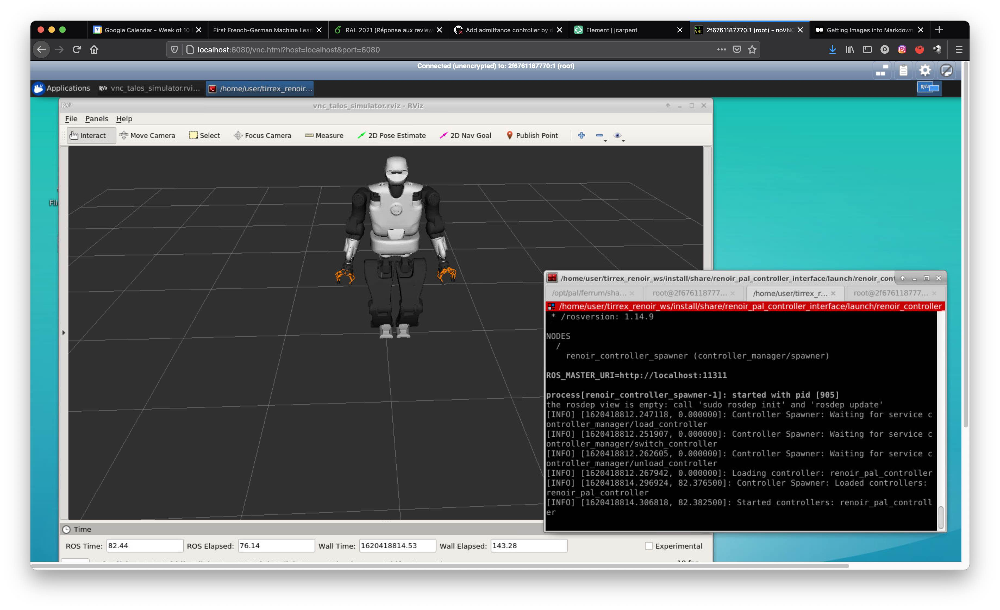

# Controller abstract interface

This package provides an abstract interface to the RENOIR robot with a simple example.
The aim of this abstract interface is to handle various implementations of controllers and 
load them in the RENOIR robot (for now we have the TALOS robot).

The nominalSetSensors method provides the sensor information from the robot.
A map of double vectors allows differenciating betwen IMU data, force data, encoders and so on.

The getControl method provides the call to compute the control law.
The user is expected to fill in the map of control double vector values.


# Cloning, building and installing

```
mkdir -p tirrex_renoir_ws/src
cd tirrex_renoir_ws/src
git clone https://github.com/olivier-stasse/renoir_controller_abstract_interface.git
catkin build renoir_controller_abstract_interface
```


# Testing 

There is a simple node loading an interface and making a simple call to each abstract method 
(setupSetSensors, nominalSetSensors, cleanupSetSensors, getControl).

```
rosrun renoir_controller_abstract_interface load_renoir_controller_node ./devel/lib/librenoir_controller_example_interface.so
```

The current expected output is:
```
Calling ./install/lib/renoir_controller_abstract_interface/load_renoir_controller_node with ./install/lib/librenoir_controller_example_interface.so
Tried loading 
Succedded in loading ./install/lib/librenoir_controller_example_interface.so
control (0)=-1280
control (1)=-1300
control (2)=-3376.77
control (3)=2956.98
control (4)=-3600.2
control (5)=-146.54
control (6)=-1400
control (7)=-1420
control (8)=-3496.77
control (9)=2836.98
control (10)=-3720.2
control (11)=-83.54
control (12)=-760
control (13)=-763.239
control (14)=-3874.15
control (15)=-3915.39
control (16)=-800.01
control (17)=-107.268
control (18)=-82
control (19)=-83
control (20)=-79
control (21)=0
control (22)=-4351.69
control (23)=-878.652
control (24)=-87.99
control (25)=-115.268
control (26)=-90
control (27)=-91
control (28)=20.8
control (29)=0
control (30)=0
control (31)=0
```

# Docker (to use the package renoir_pal_controller_interface)

To get the docker file:
```
docker pull registry.gitlab.com/pal-robotics/tirrex/dockers/talos_pal_physics_simulator_vnc_renoir:latest
```

To start the docker image:
```
docker run --rm -it -p 6080:6080 registry.gitlab.com/pal-robotics/tirrex/dockers/talos_pal_physics_simulator_vnc_renoir:latest
```

The output displayed in the terminal is:
```
Please be aware that you are exposing your VNC server to all users on the
local machine. These users can access your server without authentication!
/usr/bin/xauth:  file /root/.Xauthority does not exist

New '0080c85e41cf:1 (root)' desktop at :1 on machine 0080c85e41cf

Starting applications specified in /root/.vnc/xstartup
Log file is /root/.vnc/0080c85e41cf:1.log

Use xtigervncviewer -SecurityTypes None :1 to connect to the VNC server.

Warning: could not find self.pem
Starting webserver and WebSockets proxy on port 6080
WebSocket server settings:
  - Listen on :6080
  - Flash security policy server
  - Web server. Web root: /usr/share/novnc
  - No SSL/TLS support (no cert file)
  - proxying from :6080 to localhost:5901


Navigate to this URL:

    http://localhost:6080/vnc.html?host=localhost&port=6080

Press Ctrl-C to exit
```

To start accessing the linux X-Window system open your navigator and copy paste the URL given in the previous terminal output (here http://localhost:6080/vnc.html?host=localhost&port=6080)

This should display the following image:


Clic on connect on the upper right corner to access the linux X-Window system and get the following input:



# Testing with the PAL simulator

## To start the PAL simulator:
```
roslaunch talos_pal_physics_simulator talos_pal_physics_simulator_with_actuators_wo_rviz.launch robot:=full_v2 headless:=false speedrun:=false
```
or it is possible to use the following alias:
```
start_renoir
```

## To display the robot from the simulator:
```
rosrun rviz rviz -d /opt/pal/ferrum/share/talos_pal_physics_simulator/config/rviz/
```
or it is possible to use the following alias:
```
start_renoir_rviz
```

## Half sitting starting position
The robot starts with a straight position.
It can be problematic as the robot is near a singularity.
It is necessary to put it in a specific configuration.
In another terminal:
```
roslaunch talos_controller_configuration position_controllers.launch
```
or
```
start_pos_ctrl
```

In a third terminal, you need to first load the half sitting position:
```
rosparam load ./src/renoir_pal_controller_interface/config/half_sitting.yaml
```
Once this is done the following line makes the robot moves from the straight position to the half-sitting position:
```
rostopic pub /play_motion/goal play_motion_msgs/PlayMotionActionGoal '[1, now, nope]' '[now,nope]' '[half_sitting,True,0]'
```

The two previous action are launched by the following alias:
```
launch_half_sitting
```

## Starting your controller
Finally when the robot has reached this position, you can stop the position controller with CTRL+C, and then
launch your controller:
```
roslaunch renoir_pal_controller_interface renoir_controller_effort.launch
```

The result is depicted in the following image


